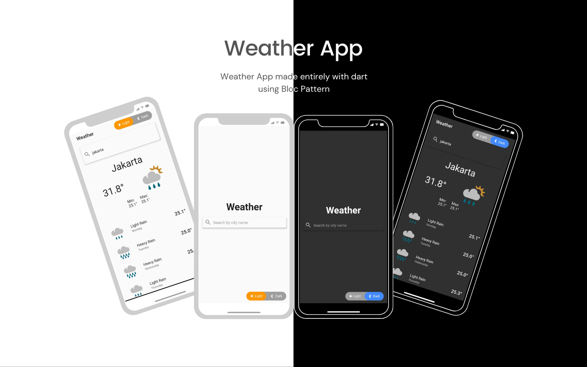

<p align="center">
  
</p>

## ⛅ Weather App
Weather app made using flutter bloc pattern. Made with <span style="color: #e25555;">&#9829;</span> in Surabaya
<br><br>
<p align="center">
  
</p>

## API
For detail API, you can find it [Here](https://www.metaweather.com/api/) 

## How to use it?
```cli
git clone
flutter pub get
flutter run
```

### if you like the project, please take a moment to click ⭐ ^^

### Credits
Icon - <a href='https://pngtree.com/so/cloud'>pngtree/</a>
